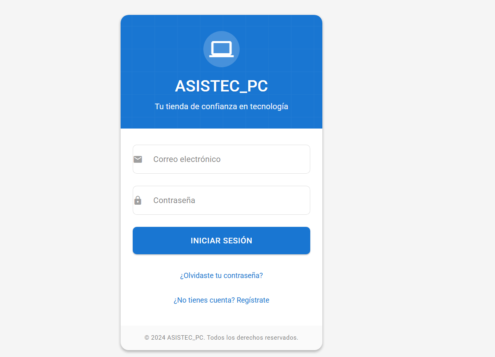

# Proyecto: Login para ASISTEC_PC

Este proyecto consiste en el diseño e implementación de un sistema de inicio de sesión (**login**) para la tienda de tecnología **ASISTEC_PC**.  
Fue desarrollado como parte de la asignatura **Seguridad de Software**, en la carrera de **Ingeniería de Software**.

---

## 🚀 Tecnologías utilizadas

- **Visual Studio Code**: editor de código.  
- **HTML5**: estructura del contenido.  
- **CSS3**: estilos visuales y diseño moderno.  
- **JavaScript**: validación del login y control de la sesión.  
- **Material Design 3**: componentes visuales, tipografía e íconos.  

---

## 📂 Estructura del proyecto (MVC)

- **Vista**: `login.html`, `bienvenida.html`, `styles.css`  
- **Controlador**: `loginController.js`  
- **Modelo**: `usuario.js`  

---

## ⚙️ Funcionamiento del login

1. El usuario ingresa correo y contraseña.  
   - Correo válido: **admin@asistec.com**  
   - Contraseña válida: **asistec123**  

2. El sistema valida con JavaScript:
   - Formato correcto del correo (expresión regular).  
   - Longitud mínima de contraseña (6 caracteres).  
   - Coincidencia exacta con las credenciales almacenadas.  

3. Si los datos son correctos:
   - Se crea una sesión en **LocalStorage**.  
   - El usuario es redirigido a la página de bienvenida.  

4. En caso de error:
   - Se muestran mensajes de validación en color rojo (`#f44336`) siguiendo Material Design.  

---

## 🔒 Seguridad implementada

- Validación de entradas antes de procesar datos.  
- Redirección automática si no existe una sesión activa.  
- Función de **cierre de sesión** que elimina la información de LocalStorage.  
- Bloqueo temporal del botón de login para evitar múltiples envíos.  

⚠️ **Nota**: este proyecto es académico y no utiliza encriptación ni base de datos.  
En un entorno real se recomienda:  
- Autenticación del lado del servidor.  
- Contraseñas cifradas.  
- Uso de **tokens seguros (JWT)**.  

---

## 🖼️ Vista previa

---

## 📚 Autor

- **Jostin Fernando Chalan Mora**  

Asignatura: **Seguridad de Software**  
Docente: **Jaime Alberto Falquez Jaramillo**  
Periodo: **Agosto – Diciembre 2025**

---

## 📄 Licencia

Este proyecto es de uso académico y educativo.  
Puedes adaptarlo y mejorarlo libremente.
